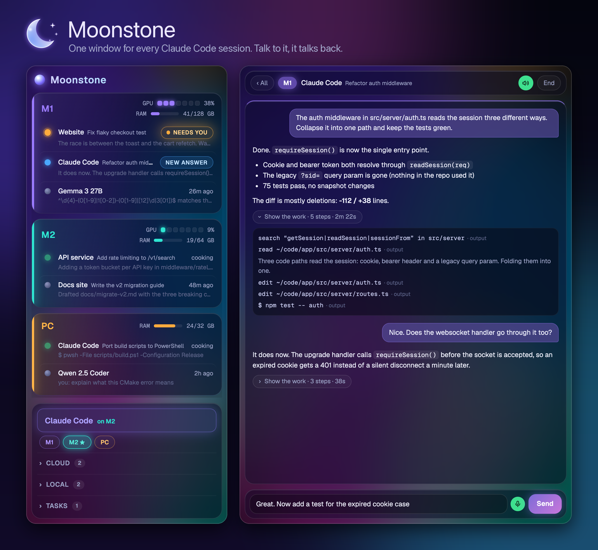
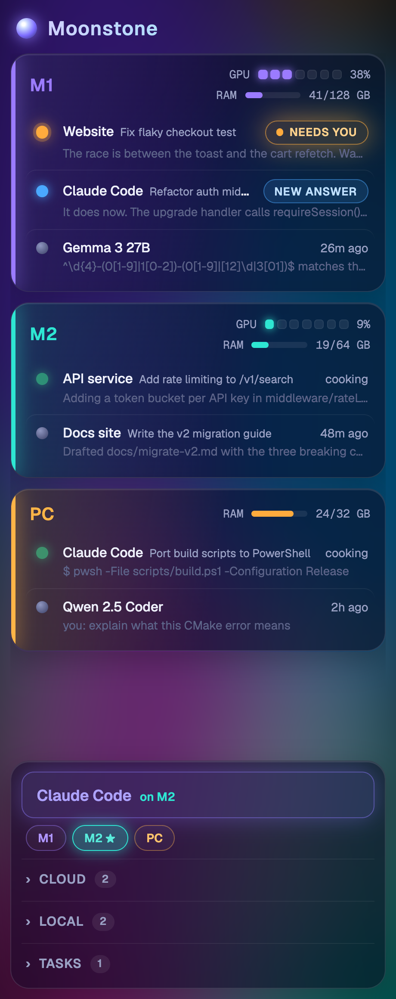
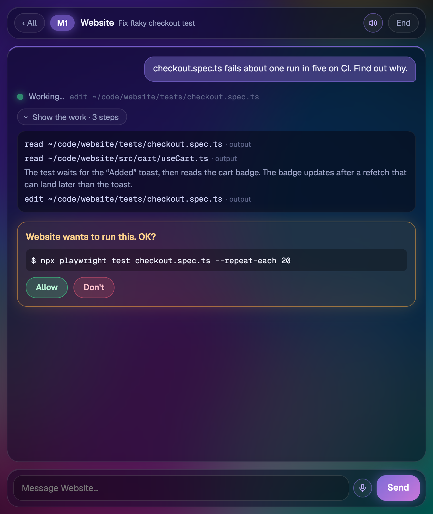
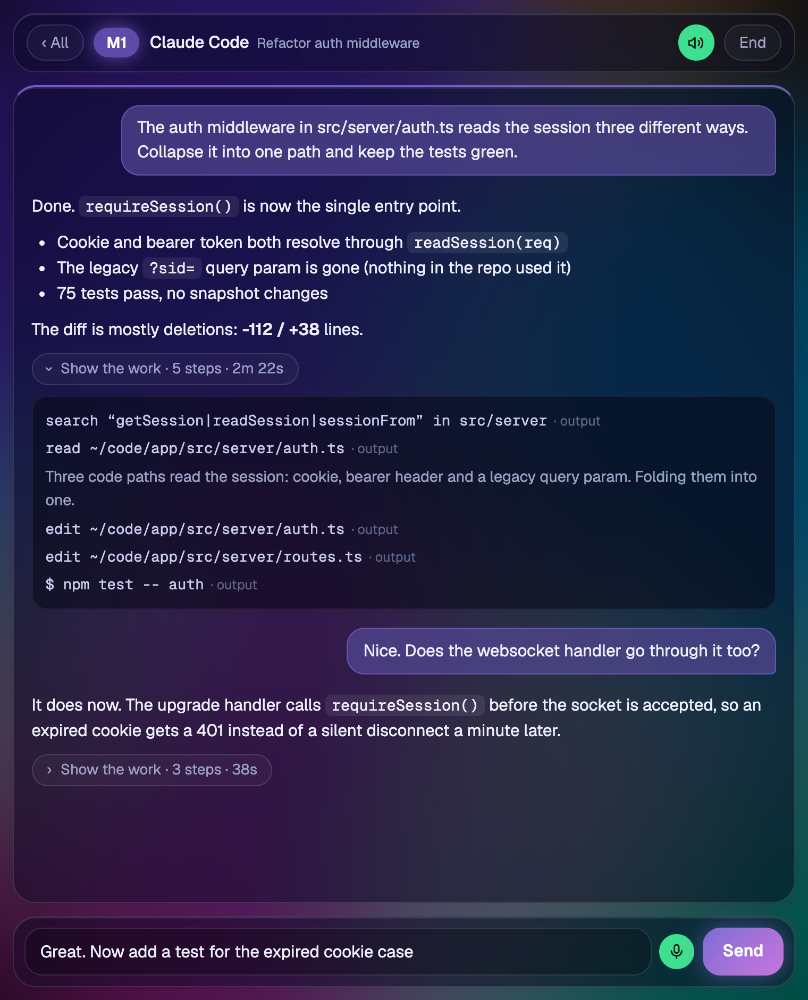
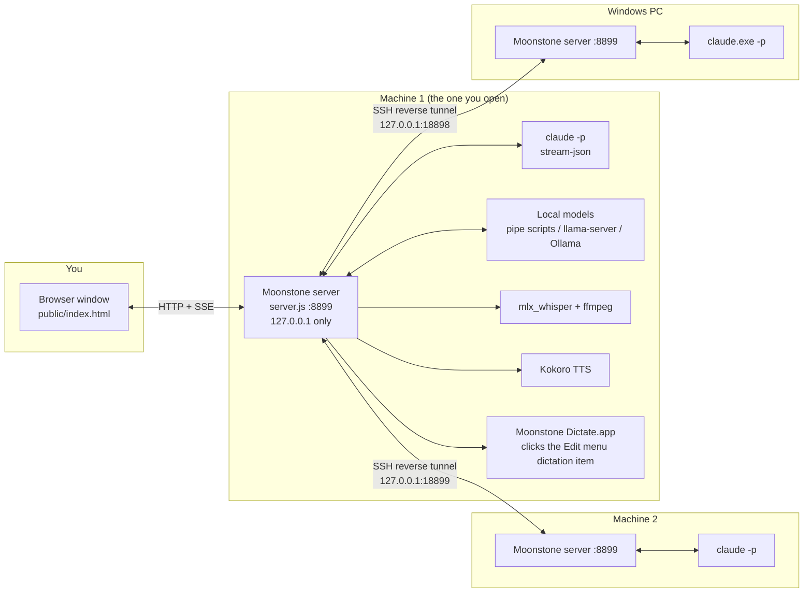

<div align="center">


# Moonstone

**A local voice control panel for your Claude Code sessions, across every machine you own.**

[](LICENSE)


[Website](https://nicedreamzapp.github.io/moonstone/) · [Quick start](#quick-start) · [Configuration](#configuration) · [Security](#security-model)



</div>

## Why we built it

We run a lot of Claude Code sessions at once, on a couple of Macs and a Windows PC. Keeping track of which terminal was waiting on a permission prompt, which one had finished, and which machine had room for another job turned into a job of its own.

Moonstone puts all of it in one browser window. Every session on every machine shows up in one list, sorted so the ones that need you are on top. You can open any of them, read the answer, approve the next step, and send the next instruction by voice while your hands are busy with something else. Answers can be read back to you. Local models sit in the same list as Claude, so a quick question to a model on your own GPU is one tap away.

It is one Node file and one HTML file. No npm dependencies, no build step, no cloud service. It binds to `127.0.0.1` and machines reach each other over SSH tunnels you already trust.

## What it does

### Every session, every machine, one list



- **Sessions grouped by machine**, each with a live GPU gauge (macOS) and a RAM bar. RAM is measured the way Activity Monitor counts "Memory Used", so a model that is loaded but idle still shows up.
- **Sorted by what needs you**: waiting on a permission prompt, then errors, then new answers, then working, then idle.
- **Two kinds of sessions.** *Dock* sessions are headless `claude -p` processes that Moonstone starts and owns. *Terminal* sessions are Claude Code processes already running in a terminal; Moonstone reads their transcripts, and typing into one stops the terminal copy and resumes the same conversation inside Moonstone with its full history.
- **Launchers** start new sessions. A launcher that exists on several machines gets machine chips; the starred chip is the least busy machine (fewest sessions working, then lowest GPU, then your preferred order). Tap a chip to pin a launcher to a machine.
- **Warm spares.** Moonstone keeps one idle `claude` process ready per launcher, so a new session skips the startup wait (loading MCP servers can take a while).
- Sessions you open but never use tidy themselves away after 30 minutes.

<br clear="right">

### Conversations, approvals and the work behind each answer



- **Permission prompts** arrive as an Allow / Don't card. Moonstone runs Claude Code with `--permission-prompt-tool stdio`, so it answers the real prompt; nothing is auto-approved. Questions Claude asks with options (`AskUserQuestion`) show up as buttons.
- **The work folds away.** Each answer shows the final text; the tool calls behind it sit under a "Show the work · 5 steps · 2m 22s" bar. Older turns load their work only when you open it.
- **End** stops the session's process and removes it from every open window, on every machine.
- The page reloads itself when `public/index.html` changes, but waits until your message box is empty.

### Voice in, voice out



**Push to talk.** Tap the mic, talk, tap again (or press Enter) and it stops listening and sends. Moonstone tries three paths, best first:

1. **Your OS's own dictation.** On macOS a small signed helper app opens the focused app's *Edit* menu and clicks *Start Dictation* or *Stop Dictation*, then checks with CoreAudio that a microphone actually turned on or off, retrying once if it did not. On Windows it presses Win+H. Words type straight into the message box at native speed.
2. **The browser's speech recognition**, where the browser can actually run it. If it fails once, Moonstone remembers and stops trying it.
3. **Local Whisper.** The browser records, posts the audio to `/api/stt`, and the server runs `ffmpeg` and `mlx_whisper` (`mlx-community/whisper-large-v3-turbo` by default) on the same machine. While you talk it keeps re-transcribing what you have said so far, one request at a time, so the words trail your voice instead of arriving at the end. Recordings are capped at two minutes.

**Narration.** Tap the speaker in a conversation and every answer that finishes from then on is read aloud. The server sends the text, split into sentences, to a local TTS server (Kokoro, voice `af_heart` by default) and plays the WAVs back in order. Code blocks are skipped and links become "a link". With Moonstone open on several machines, only the window you touched last speaks.

### Local models in the same list

| Launcher kind | What it runs |
|---|---|
| `claude` | A headless Claude Code session (`claude -p --input-format stream-json --output-format stream-json`) |
| `pipe` | A script that reads one line on stdin and prints `›` when it is ready for the next. Good for a llama.cpp or MLX chat loop. |
| `api` | Any OpenAI-style `/v1/chat/completions` server (llama.cpp `llama-server`, Ollama, LM Studio). With a `serve` command, Moonstone starts the server on the first message. |
| `open` | Opens an app on that machine. |

Local models are memory hungry, so a `pipe` chat or a server Moonstone started is shut down after **30 idle minutes** and comes back on the next message.

## How it fits together



Every machine runs the same `server.js`. The one you open in the browser lists its peers in `config.json`, polls each peer's `/api/local`, relays their change events, and forwards any request for a session named `<peer>~<id>` to that peer. Transcripts are read from `~/.claude/projects/**/<session>.jsonl` incrementally, so a dock session and a terminal session look the same.

## Quick start

You need Node 18 or newer and [Claude Code](https://docs.claude.com/en/docs/claude-code) installed.

```bash
git clone https://github.com/nicedreamzapp/moonstone.git
cd moonstone
cp config.example.json config.json   # edit launchers and peers, or start with {}
node server.js
```

Open **http://localhost:8899**. Set `DOCK_PORT` to use another port.

Want to look around first? `node tools/demo-server.js` serves the real UI on http://localhost:8890 with made-up sessions. That is what the screenshots here were taken from.

### Linking machines

Run `node server.js` on each machine. On the machine you will open in the browser, give each peer a local port and forward it over SSH. From the peer:

```bash
ssh -N -R 18899:127.0.0.1:8899 you@main-machine
```

or from the main machine:

```bash
ssh -N -L 18899:127.0.0.1:8899 you@peer-machine
```

Then list it in `config.json` as `{"id": "m2", "name": "M2", "url": "http://127.0.0.1:18899"}`. A peer that does not answer shows as offline; its sessions come back when the tunnel does. Run the tunnel under `launchd`, `systemd` or `autossh` if you want it to survive reboots.

### macOS dictation helper

The mic's best path on a Mac needs a tiny helper app, because clicking a menu item in another app requires the Accessibility permission, and that permission belongs to a signed app, not to Node.

```bash
cd mac
./build.sh "Apple Development: Your Name (XXXXXXXXXX)"   # any stable codesign identity
open -g ~/Applications/"Moonstone Dictate.app" --args check
```

Then allow **Moonstone Dictate** under System Settings > Privacy & Security > Accessibility. Find your identity with `security find-identity -v -p codesigning`. Without one, `./build.sh` signs ad-hoc (`codesign -s -`), which works but loses the permission on every rebuild.

Dictation itself must be turned on in System Settings > Keyboard. The helper accepts `start`, `stop`, `status` and `check`. `mac/micon.swift` is a small companion that prints `1` when any microphone is in use, handy for checking the helper's work by hand.

### Windows notes

- Moonstone looks for `claude.exe` in `%USERPROFILE%\.local\bin` and `claude.cmd` in `%APPDATA%\npm`. Set `"claude"` in `config.json` if yours lives elsewhere.
- The mic presses **Win+H** for Windows voice typing.
- There is no MLX on Windows, so for the Whisper fallback set `stt.cmd` to your own transcriber, or `stt.forward` to a Mac running Moonstone.
- `pipe` launchers are started with `/bin/bash`, so on Windows use `api` launchers (llama-server, Ollama) for local models.
- The GPU gauge is macOS only; RAM works everywhere.

## Configuration

Everything lives in `config.json` next to `server.js`. All keys are optional. See [`config.example.json`](config.example.json).

| Key | What it does |
|---|---|
| `machine`, `name`, `color` | This machine's id, display name and accent color. |
| `peers` | `[{id, name, url, color}]`, other Moonstone servers reached through `127.0.0.1` tunnels. |
| `prefer` | Machine ids in order of preference when picking the best machine for a launcher. Defaults to this machine, then peers. |
| `launchers` | `[{label, group, kind, cwd, mode, color, note, ...}]`. `group` is `main`, `cloud`, `local` or `tasks`. `mode` is a Claude Code permission mode. `pipe` needs `cmd`; `api` needs `url` and takes `serve: {cmd, args}`, `system`, `model` and `health` (default `/health`, use `/` for Ollama); `open` needs `path`. Without this key, Moonstone looks for Ghostty launcher apps (`*.app/Contents/Resources/launch.ghostty`) in `~/Desktop/Launchers` and `~/Desktop`. |
| `warm` | Launcher labels that get a warm spare. Without it every `claude` launcher does; `[]` turns spares off. |
| `claude` | Path to the `claude` binary. |
| `stt` | `{python, model, ffmpeg}` for mlx_whisper, or `{cmd, args}` with `{file}` standing in for a 16 kHz WAV, or `{forward: "http://127.0.0.1:PORT/api/stt"}` to hand audio to another machine. |
| `tts` | `{url, voice, speed}`. Moonstone POSTs `{text, voice, speed}` and expects WAV back. Default `http://127.0.0.1:7864/tts`, voice `af_heart`. The TTS server is not part of this repo. |
| `dictate` | `{app}` to point at the helper app, `{off: true}` to disable OS dictation on this machine. |
| `remoteOrigins` | Origins allowed to call `/api/dictate` cross-origin, for when you serve the page from somewhere else. Empty by default. |
| `oneWindowTerminals` | Terminal app names that run one process per window; their window is closed when a session moves into Moonstone. |

## Security model

Moonstone can run commands on your machines, so it is deliberately boring about access:

- **Loopback only.** The server listens on `127.0.0.1`. Other machines reach it through SSH tunnels, never an open port.
- **Host check.** Any request whose `Host` header is not `127.0.0.1` or `localhost` gets a 403, which blocks DNS rebinding.
- **CSRF guard.** Every POST must carry an `X-Dock: 1` header. A page on another site can only send a custom header after a CORS preflight, and Moonstone grants none, except for `/api/dictate` to origins you list in `remoteOrigins`.
- **Approvals stay with you.** Sessions run in the permission mode you configure, and prompts come to the window instead of being auto-accepted.
- **Audio stays local.** Transcription and speech run on your own machines. Temporary audio files are deleted after each transcription.
- If you put Moonstone behind a reverse proxy, have the proxy add `X-Via-Proxy: 1`. Moonstone then treats those windows as remote: they will not press dictation keys on a screen you are not sitting at, and they will not be pulled to sessions started from local launchers.

## Project layout

```
server.js              the whole backend: sessions, peers, voice, HTTP + SSE
public/index.html      the whole frontend: no framework, no build
config.example.json    a starting config
tools/demo-server.js   the UI with invented data, for trying it out and screenshots
mac/                   Moonstone Dictate helper (Swift) and build script
icon/                  app icons and the Python scripts that draw them
docs/                  the project website (GitHub Pages)
```

## License

[MIT](LICENSE)
